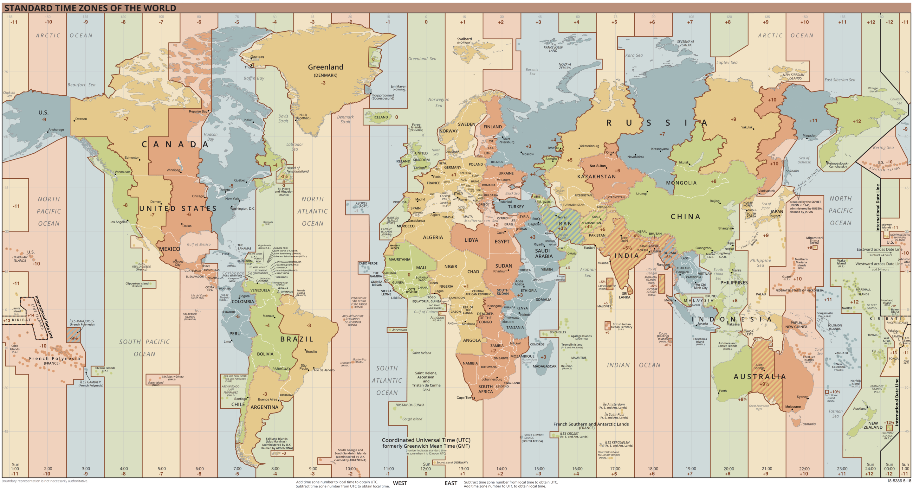

##  Date Time Validator


### Overview
The Date Time Validator program is a simple Java program that can:
1. Generate test data with customized date time pattern, customized data size, and duplicated values (see `Test Data` section).
1. Read a large list of date-time values from a `txt` file
1. Validate the date-time value, format it into the standard ISO 8601 format: YYYY-MM-DDThh:mm:ssTZD. For example, `2022-07-20T18:01:02Z`. Details see [ISO 8601 wikipedia page](https://en.wikipedia.org/wiki/ISO_8601) and [offical ISO page](https://www.iso.org/iso-8601-date-and-time-format.html).
1. Duplicate date-time values are dropped. Depending on the requirements, duplicates can be removed in two ways:
    1. `UniqueMoment`: Two diffrent date-time values in ISO 8601 format at the same moment are considered as duplicates: `2022-07-20T18:01:02Z` and `2022-07-20T15:01:02-03:00`. This is the defualt setting.
    1. `UniqueString`: Date-time values at the same moment are not considered as duplicates as long as they are at different time zones.
1) Write the formatted unique date-time values into a txt file.  

  
## Requirements

* Java 8 or over

## Assumptions

* The program knows the date-time format of test data(i.e., `dateTimeFormat` in TestDataGenerator). All test data has the same date-time format.
* The input date-time values have duplicates. Values are generated randomly and can be parsed into the ISO 8601 format.
* Year: The randomly generated test data are between Year 1900 to Year 2030. But the program should work for all valid date-time values.
* Days in a month: For simplicity, months can have up to 31 days (i.e., February 31st is considered valid though there is no 31th day in February).
* Time zone: According to the [Coordinated Univerisal Time (UTC)](https://en.m.wikipedia.org/wiki/Time_zone), some countries and regions use UTC-12:00, UTC+12:45, UTC+13:00, UTC+14:00. For the purpose of this program, these time zones are considered invalid. Only UTC-11:00 to UTC+12:00 are considered valid.
  

  Time zones of the world


## Test Data:

* To successfully create test data, all the date time information are required: `YYYY` for year, `MM` for month, `DD` for day, `hh` for hour, `mm` for minute, `ss` for second, `TZD` for time zone. All arguments can only present in format once, otherwise will be invalid `dateTimeFormat`.iY
* `TZD` conforms ISO 8601 time zone designator: (“Z” for GMT or +hh:mm or -hh:mm)
* Examples of valid `dateTimeFormat` (Inspired from [SimpleDateFormat Documentation](https://docs.oracle.com/javase/8/docs/api/java/text/SimpleDateFormat.html)), sample test data see the `data/example_patterns` directory:
  > Format 1: YYYY-MM-DDThh:mm:ssTZD: 2022-07-20T15:01:02-03:00

  > Format 2: YYYY.MM.DD at hh:mm:ss TZD: 2022.07.20 at 15:01:02 -03:00

  > Format 3: MM/DD/YYYY: hh:mm:ss, TZD: 07/20/2022: 15:01:02, -03:00

  > etc.
* Sample test data:
  > 100000_Size_0_Duplicates_Format1.txt: 100,000 randomly generated date-time values in Format 1 with 0 copied duplicated values.
  
  > 100000_Size_10000_Duplicates_Format1.txt: 100,000 randomly generated date-time values in Format 1 with 10,000 copied duplicated values.
  
  > 100000_Size_10000__Duplicates_Format2.txt: 100,000 randomly generated date-time values in Format 2 with 10,000 copied duplicated values.
  
  > 100000_Size_10000__Duplicates_Format3.txt: 100,000 randomly generated date-time values in Format 3 with 10,000 copied duplicated values.
  
  > Manually_typed_test_data.txt (should have 4 unique data-time moments, 6 unique date-time strings):
    ```
    2000-01-01T00:00:00-05:00
    2000-01-01T00:00:00-05:00
    2000-01-01T05:00:00Z
    2000-01-01T05:00:00Z
    2000-01-01T10:00:00+05:00
    2000-01-01T10:00:00+05:00
    2001-01-01T05:00:00Z
    2002-01-01T05:00:00Z
    2003-01-01T05:00:00Z
    ```

* Testing results see `data/logs.txt`.


## Notes:
* Unique date-time values size limit: According to [HashSet.java source code](http://hg.openjdk.java.net/jdk8/jdk8/jdk/file/687fd7c7986d/src/share/classes/java/util/HashSet.java), the size limit should be `Integer.MAX_VLAUE`, which is 32 bits number at 2147483647, slightly more than 2 billion. When the size exceeds Integer.MAX_VALUE, it overflows. 
* If the size of unique date time values is large, options can be using a relational SQL database or noSQL database to store hashing keys. Using LRU cache for faster performance as it allows false negatives but no false positives. If a date-time value is present in LRU cache, there is no need to check with database in disk.